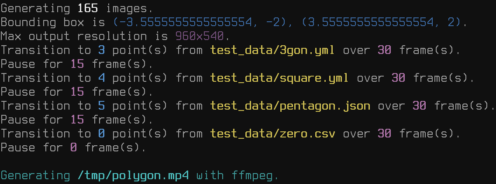

# mb-geometry

Recreational Ruby tools for geometry.  This ranges from simple functions like
area calculation and line intersection, to Delaunay triangulation and Voronoi
partitions.  This is companion code to my [educational video series about code
and sound][0].

https://user-images.githubusercontent.com/5015814/115095460-41428300-9ed6-11eb-800c-2c00307309f9.mp4

```bash
XRES=960 YRES=540 bin/voronoi_transitions.rb /tmp/polygon.mp4 \
    test_data/3gon.yml 30 15 \
    test_data/square.yml 30 15 \
    test_data/pentagon.json 30 15 \
    test_data/zero.csv 30 0
```



You might also be interested in [mb-sound][1], [mb-math][2], and [mb-util][3].

This code is reasonably well-tested, but I recommend using it for non-critical
tasks like fun and offline graphics, and not for making important decisions or
mission-critical data modeling.

## Installation and usage

This project contains some useful programs of its own, or you can use it as a
Gem (with Git source) in your own projects.

### Standalone usage and development

First, install a Ruby version manager like RVM.  Using the system's Ruby is not
recommended -- that is only for applications that come with the system.  You
should follow the instructions from https://rvm.io, but here are the basics:

```bash
gpg2 --recv-keys 409B6B1796C275462A1703113804BB82D39DC0E3 7D2BAF1CF37B13E2069D6956105BD0E739499BDB
\curl -sSL https://get.rvm.io | bash -s stable
```

Next, install Ruby.  RVM binary rubies are still broken on Ubuntu 20.04.x, so
use the `--disable-binary` option if you are running Ubuntu 20.04.x.

```bash
rvm install --disable-binary 2.7.3
```

You can tell RVM to isolate all your projects and switch Ruby versions
automatically by creating `.ruby-version` and `.ruby-gemset` files (already
present in this project):

```bash
cd mb-geometry
cat .ruby-gemset
cat .ruby-version
```

Now install dependencies:

```bash
bundle install
```

### Using the project as a Gem

To use mb-geometry in your own Ruby projects, add this Git repo to your
`Gemfile`:

```ruby
# your-project/Gemfile
gem 'mb-geometry', git: 'https://github.com/mike-bourgeous/mb-geometry.git'
gem 'mb-math', git: 'https://github.com/mike-bourgeous/mb-math.git'
```

## Examples

Check out all of the scripts in `bin/`; they usually have a header comment
describing what they do.

### Generate SVG of a Voronoi partition

From the shell:

```bash
bin/voronoi_to_svg.rb test_data/pentagon.json /tmp/pentagon.svg
```

From code:

```ruby
require 'mb-geometry'
# The Hash must be inside an Array to prevent it being interpreted as keyword args
# Rotation is in degrees
v = MB::Geometry::Voronoi.new([{ generator: :polygon, sides: 5, rotate: 30 }]) ; nil
v.save_svg('/tmp/pentagon_from_code.svg')

# You can save the Delaunay triangulation instead:
v.save_delaunay_svg('/tmp/pentagon_delaunay.svg')
```

### Area of a polygon

```ruby
MB::Geometry.polygon_area([[0, 0], [1, 0], [1, 1], [0, 1]])
# => 1.0
```

### Delaunay triangulation

#### Pure Ruby algorithm

The `triangulate.rb` command prints each input point's neighbors and the final
list of triangles in Ruby Hash syntax.

```bash
DELAUNAY_ENGINE=delaunay bin/triangulate.rb test_data/square.yml
```

#### Rubyvor gem algorithm

```bash
DELAUNAY_ENGINE=rubyvor bin/triangulate.rb test_data/square.yml
```

## Testing

Run `rspec`, or play with the included scripts under `bin/`.

## Contributing

Pull requests welcome, though development is focused specifically on the needs
of my video series.

## License

This project is released under a 2-clause BSD license.  See the LICENSE file.

## See also

### Dependencies

TODO

### References

See README-Delaunay.md

TODO


[0]: https://www.youtube.com/playlist?list=PLpRqC8LaADXnwve3e8gI239eDNRO3Nhya
[1]: https://github.com/mike-bourgeous/mb-sound
[2]: https://github.com/mike-bourgeous/mb-math
[3]: https://github.com/mike-bourgeous/mb-util
